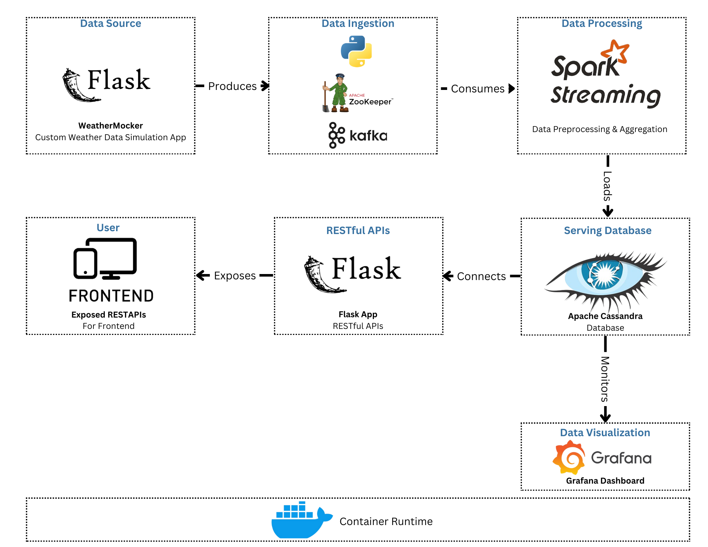
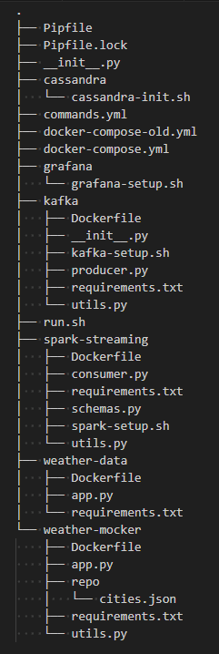

# Weather Data Pipeline

<div align="center">



</div>

## Overview

This project implements a weather data pipeline that generates, ingests, processes, stores, and visualizes weather data in real-time. It uses Flask for data generation, Kafka for data ingestion, Spark for processing, Cassandra for storage, and Grafana for visualization.

## Directory Structure
<div align="center">



</div>

## Components

### WeatherMocker
- **Purpose**: Generates random weather data simulating a real weather API.
- **Main File**: `weather-mocker/app.py`
- **Dependencies**: `weather-mocker/requirements.txt`

### WeatherData
- **Purpose**: Exposes an API to access weather data stored in Cassandra.
- **Main File**: `weather-data/app.py`
- **Dependencies**: `weather-data/requirements.txt`

### Kafka
- **Setup Script**: `kafka/kafka-setup.sh`
- **Description**: Creates a Kafka topic if it does not exist.
- **Producer**: `kafka/producer.py`

### Cassandra
- **Setup Script**: `cassandra/cassandra-init.sh`
- **Description**: Initializes Cassandra by creating a keyspace and table if they do not exist.

### Spark-Streaming
- **Setup Script**: `spark-streaming/spark-setup.sh`
- **Description**: Configures Spark for streaming and initializes necessary settings.
- **Consumer**: `spark-streaming/consumer.py`

### Grafana
- **Setup Script**: `grafana/grafana-setup.sh`
- **Description**: Installs the Cassandra plugin, adds the data source, and creates a dashboard for real-time data visualization.

## Integration Workflow

1. **Data Generation and Publishing**:
   - WeatherMocker generates random weather data.
   - Kafka producer publishes the data to a Kafka topic.

2. **Data Consumption and Processing**:
   - Spark-Streaming consumes data from Kafka, processes it, and writes it to Cassandra.

3. **Data Visualization**:
   - Grafana visualizes the real-time data stored in Cassandra.

## Deployment

The entire stack is managed using Docker Compose, defined in `docker-compose.yml`. Each service runs in its own Docker container.

## Running the Pipeline

To run the Docker pipeline, run the following two commands from the root directory:

1. Make the `run.sh` script executable:
   ```sh
   $ chmod +x run.sh
   $ ./run.sh